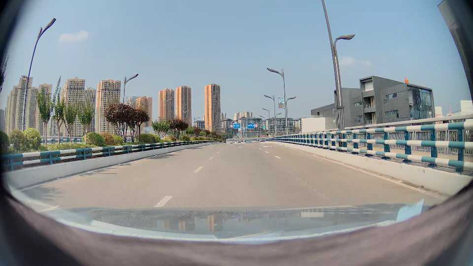
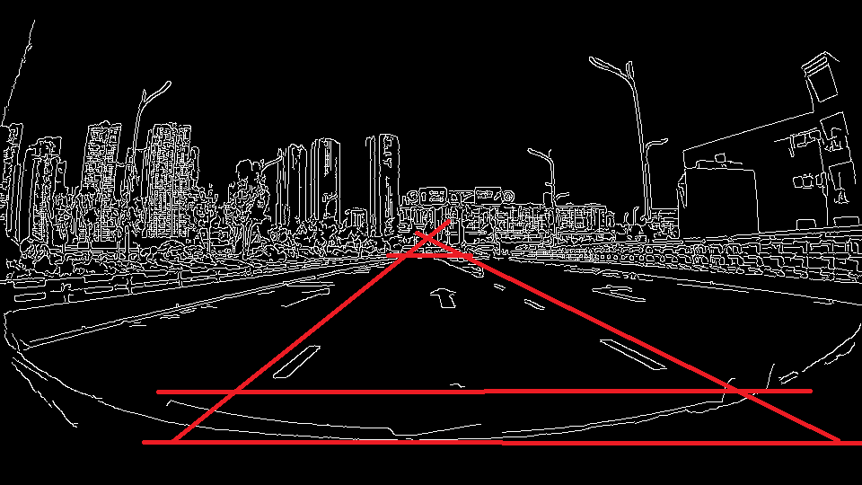
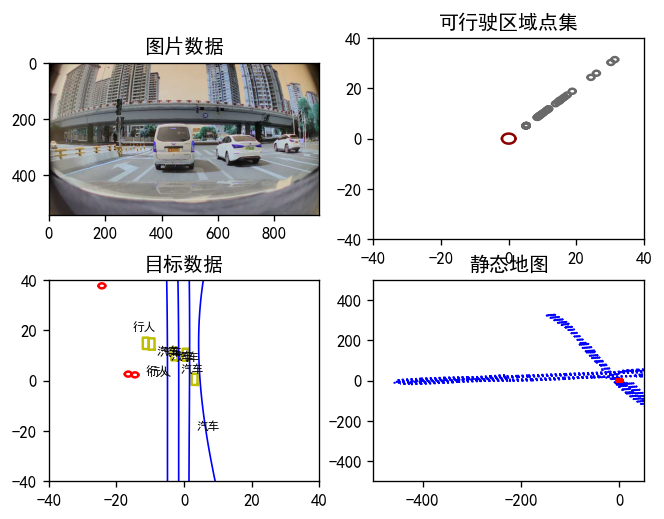

# Auto drive system based on multimodal input fusion
This project is a self-learning code, which aims to convert, record and display the real-time data of automobile driving in OpenDriver format. At the same time, the corresponding annotation tools are provided. At the same time, test and verify the combination of the basic Model Passive Control method and RL method.

## Dataset Description
The current dataset is based on private company data.

## Code structure description

### 0.data_prepare
Extract relevant information from CVS files and form serialized dates (including separated cvs, PNG, mov).

### 2.landlinedetection
A Simple Lane Line Detection Tool.

### 3.HighwaySpeedControl
Simple simulation based on expressway data.

### 4.mpc2
The implementation of model predictive control version of vision sensor is considered.

### 5.ObstacleAvoidance

### 6.ParkingControl

### 7.Steering wheel angle and throttle prediction
Implementation of a model predictive control model based on Tensorflow neural network..
